# Visualize Data
Emmanuel Laureano-Maravilla

Try your code again

``` r
 #label: setup

 library(tidyverse)
```

    ── Attaching core tidyverse packages ──────────────────────── tidyverse 2.0.0 ──
    ✔ dplyr     1.1.4     ✔ readr     2.1.6
    ✔ forcats   1.0.1     ✔ stringr   1.6.0
    ✔ ggplot2   4.0.1     ✔ tibble    3.3.1
    ✔ lubridate 1.9.4     ✔ tidyr     1.3.2
    ✔ purrr     1.2.1     
    ── Conflicts ────────────────────────────────────────── tidyverse_conflicts() ──
    ✖ dplyr::filter() masks stats::filter()
    ✖ dplyr::lag()    masks stats::lag()
    ℹ Use the conflicted package (<http://conflicted.r-lib.org/>) to force all conflicts to become errors

## Your Turn 0

Add a setup chunk that loads the tidyverse packages.

``` r
head(mpg)
```

    # A tibble: 6 × 11
      manufacturer model displ  year   cyl trans      drv     cty   hwy fl    class 
      <chr>        <chr> <dbl> <int> <int> <chr>      <chr> <int> <int> <chr> <chr> 
    1 audi         a4      1.8  1999     4 auto(l5)   f        18    29 p     compa…
    2 audi         a4      1.8  1999     4 manual(m5) f        21    29 p     compa…
    3 audi         a4      2    2008     4 manual(m6) f        20    31 p     compa…
    4 audi         a4      2    2008     4 auto(av)   f        21    30 p     compa…
    5 audi         a4      2.8  1999     6 auto(l5)   f        16    26 p     compa…
    6 audi         a4      2.8  1999     6 manual(m5) f        18    26 p     compa…

## Your Turn 1

Run the code on the slide to make a graph. Pay strict attention to
spelling, capitalization, and parentheses!

``` r
ggplot(data = mpg) +
  geom_point(mapping = aes(x=displ, y = hwy)) 
```

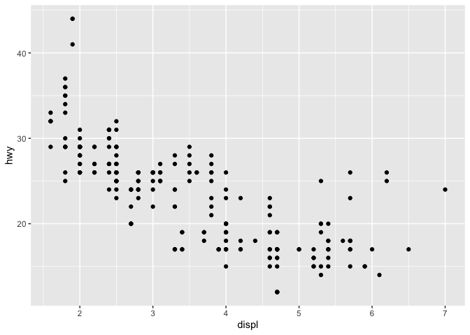

## Your Turn 2

Replace this scatterplot with one that draws boxplots. Use the
cheatsheet. Try your best guess.

``` r
ggplot(data = mpg) +
  geom_boxplot(mapping = aes(x = class, y = hwy))
```

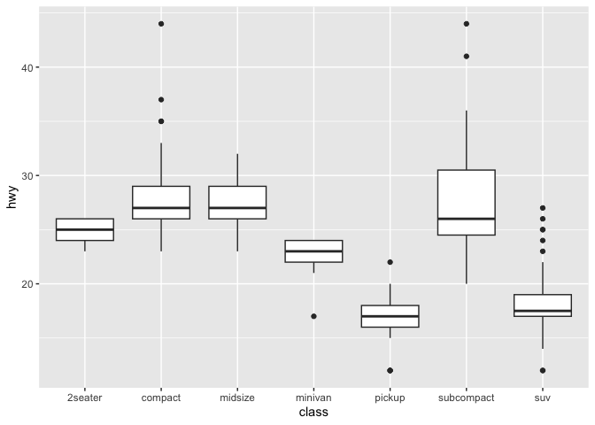

## Your Turn 3

Make a histogram of the `hwy` variable from `mpg`. Hint: do not supply a
y variable.

``` r
 #|label: add-label-3
 ggplot(data = mpg) + geom_histogram(mapping = aes(x = hwy))
```

    `stat_bin()` using `bins = 30`. Pick better value `binwidth`.

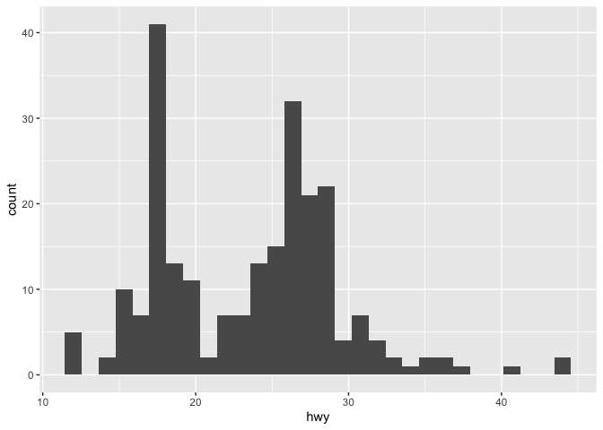

## Your Turn 4

Use the help page for `geom_histogram` to make the bins 2 units wide.

``` r
ggplot(mpg) +
  geom_histogram(aes(x = hwy), binwidth = 2)
```

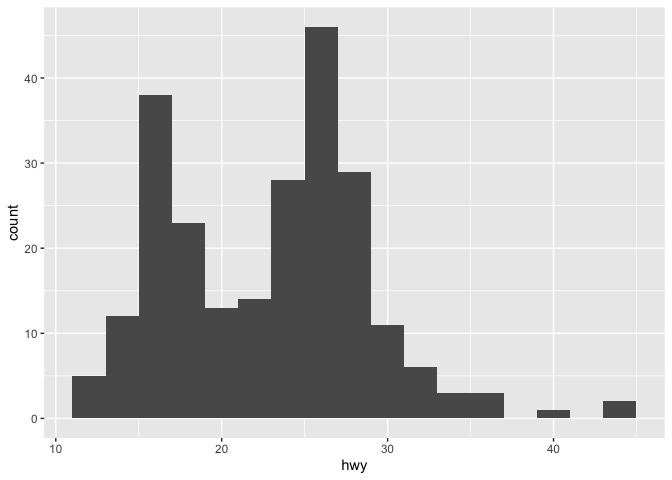

## Your Turn 5

Add `color`, `size`, `alpha`, and `shape` aesthetics to your graph.
Experiment.

``` r
ggplot(data = mpg) +
  geom_point(mapping = aes(x = displ, 
                           y = hwy,
                           color = class,
                           shape = class,
                           alpha = class,
                           size = class,
                           ))
```

    Warning: Using alpha for a discrete variable is not advised.

    Warning: Using size for a discrete variable is not advised.

    Warning: The shape palette can deal with a maximum of 6 discrete values because more
    than 6 becomes difficult to discriminate
    ℹ you have requested 7 values. Consider specifying shapes manually if you need
      that many of them.

    Warning: Removed 62 rows containing missing values or values outside the scale range
    (`geom_point()`).

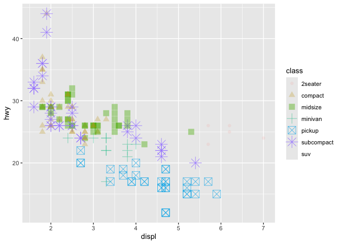

## Help Me

What do `facet_grid()` and `facet_wrap()` do? (run the code, interpret,
convince your group)

``` r
# Makes a plot that the commands below will modify
q <- ggplot(mpg) + geom_point(aes(x = displ, y = hwy))

q + facet_grid(. ~ cyl)
```

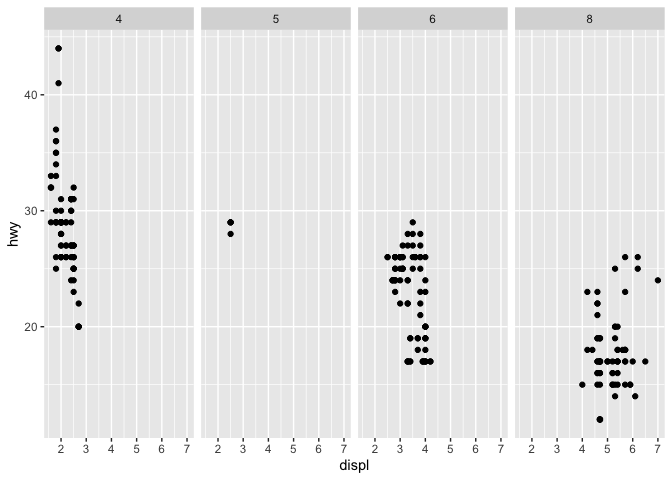

``` r
#| creates a row 4 columns
q + facet_grid(drv ~ .)
```

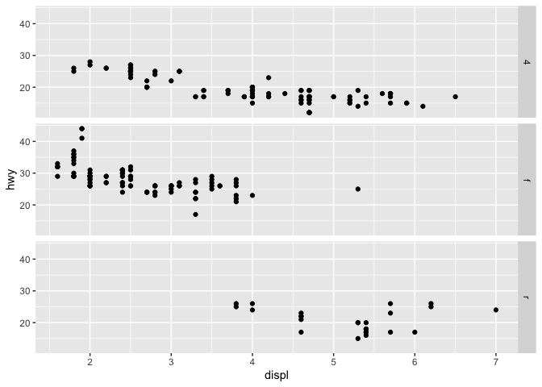

``` r
#| creates 3 row 1 comu
q + facet_grid(drv ~ cyl)
```

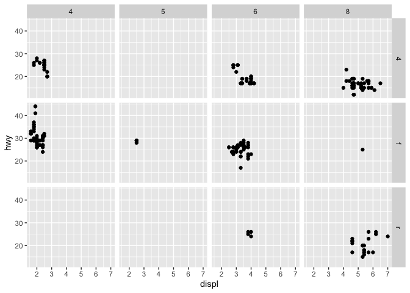

``` r
#| creates 3 rows drv and 4 columns by cyl
q + facet_wrap(~ class)
```

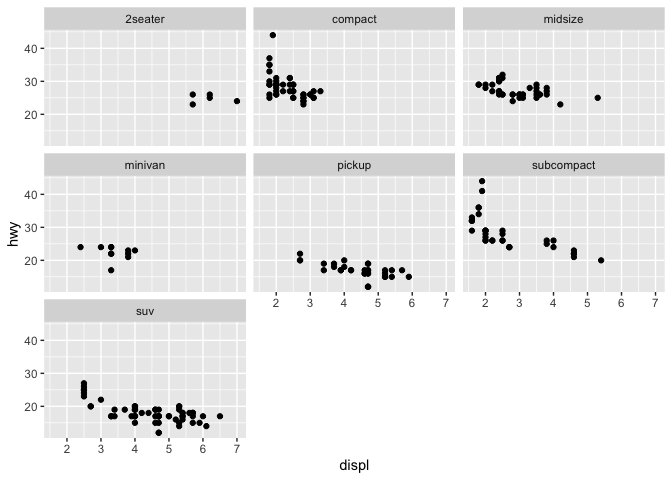

``` r
#| makes a grpah for each value
```

## Your Turn 6

Make a bar chart `class` colored by `class`. Use the help page for
`geom_bar` to choose a “color” aesthetic for class.

``` r
 ggplot(mpg) +
  geom_bar(aes(x = class, fill= class)) + 
  guides(fill = "none") +
  labs(x = "Class Vechicals",
       y = "Number of Vehicals in Sample")
```

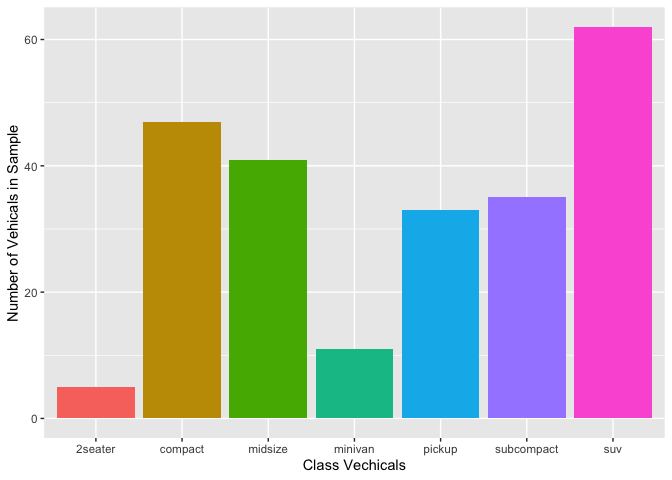

``` r
theme_bw()
```

    <theme> List of 144
     $ line                            : <ggplot2::element_line>
      ..@ colour       : chr "black"
      ..@ linewidth    : num 0.5
      ..@ linetype     : num 1
      ..@ lineend      : chr "butt"
      ..@ linejoin     : chr "round"
      ..@ arrow        : logi FALSE
      ..@ arrow.fill   : chr "black"
      ..@ inherit.blank: logi TRUE
     $ rect                            : <ggplot2::element_rect>
      ..@ fill         : chr "white"
      ..@ colour       : chr "black"
      ..@ linewidth    : num 0.5
      ..@ linetype     : num 1
      ..@ linejoin     : chr "round"
      ..@ inherit.blank: logi TRUE
     $ text                            : <ggplot2::element_text>
      ..@ family       : chr ""
      ..@ face         : chr "plain"
      ..@ italic       : chr NA
      ..@ fontweight   : num NA
      ..@ fontwidth    : num NA
      ..@ colour       : chr "black"
      ..@ size         : num 11
      ..@ hjust        : num 0.5
      ..@ vjust        : num 0.5
      ..@ angle        : num 0
      ..@ lineheight   : num 0.9
      ..@ margin       : <ggplot2::margin> num [1:4] 0 0 0 0
      ..@ debug        : logi FALSE
      ..@ inherit.blank: logi TRUE
     $ title                           : <ggplot2::element_text>
      ..@ family       : NULL
      ..@ face         : NULL
      ..@ italic       : chr NA
      ..@ fontweight   : num NA
      ..@ fontwidth    : num NA
      ..@ colour       : NULL
      ..@ size         : NULL
      ..@ hjust        : NULL
      ..@ vjust        : NULL
      ..@ angle        : NULL
      ..@ lineheight   : NULL
      ..@ margin       : NULL
      ..@ debug        : NULL
      ..@ inherit.blank: logi TRUE
     $ point                           : <ggplot2::element_point>
      ..@ colour       : chr "black"
      ..@ shape        : num 19
      ..@ size         : num 1.5
      ..@ fill         : chr "white"
      ..@ stroke       : num 0.5
      ..@ inherit.blank: logi TRUE
     $ polygon                         : <ggplot2::element_polygon>
      ..@ fill         : chr "white"
      ..@ colour       : chr "black"
      ..@ linewidth    : num 0.5
      ..@ linetype     : num 1
      ..@ linejoin     : chr "round"
      ..@ inherit.blank: logi TRUE
     $ geom                            : <ggplot2::element_geom>
      ..@ ink        : chr "black"
      ..@ paper      : chr "white"
      ..@ accent     : chr "#3366FF"
      ..@ linewidth  : num 0.5
      ..@ borderwidth: num 0.5
      ..@ linetype   : int 1
      ..@ bordertype : int 1
      ..@ family     : chr ""
      ..@ fontsize   : num 3.87
      ..@ pointsize  : num 1.5
      ..@ pointshape : num 19
      ..@ colour     : NULL
      ..@ fill       : NULL
     $ spacing                         : 'simpleUnit' num 5.5points
      ..- attr(*, "unit")= int 8
     $ margins                         : <ggplot2::margin> num [1:4] 5.5 5.5 5.5 5.5
     $ aspect.ratio                    : NULL
     $ axis.title                      : NULL
     $ axis.title.x                    : <ggplot2::element_text>
      ..@ family       : NULL
      ..@ face         : NULL
      ..@ italic       : chr NA
      ..@ fontweight   : num NA
      ..@ fontwidth    : num NA
      ..@ colour       : NULL
      ..@ size         : NULL
      ..@ hjust        : NULL
      ..@ vjust        : num 1
      ..@ angle        : NULL
      ..@ lineheight   : NULL
      ..@ margin       : <ggplot2::margin> num [1:4] 2.75 0 0 0
      ..@ debug        : NULL
      ..@ inherit.blank: logi TRUE
     $ axis.title.x.top                : <ggplot2::element_text>
      ..@ family       : NULL
      ..@ face         : NULL
      ..@ italic       : chr NA
      ..@ fontweight   : num NA
      ..@ fontwidth    : num NA
      ..@ colour       : NULL
      ..@ size         : NULL
      ..@ hjust        : NULL
      ..@ vjust        : num 0
      ..@ angle        : NULL
      ..@ lineheight   : NULL
      ..@ margin       : <ggplot2::margin> num [1:4] 0 0 2.75 0
      ..@ debug        : NULL
      ..@ inherit.blank: logi TRUE
     $ axis.title.x.bottom             : NULL
     $ axis.title.y                    : <ggplot2::element_text>
      ..@ family       : NULL
      ..@ face         : NULL
      ..@ italic       : chr NA
      ..@ fontweight   : num NA
      ..@ fontwidth    : num NA
      ..@ colour       : NULL
      ..@ size         : NULL
      ..@ hjust        : NULL
      ..@ vjust        : num 1
      ..@ angle        : num 90
      ..@ lineheight   : NULL
      ..@ margin       : <ggplot2::margin> num [1:4] 0 2.75 0 0
      ..@ debug        : NULL
      ..@ inherit.blank: logi TRUE
     $ axis.title.y.left               : NULL
     $ axis.title.y.right              : <ggplot2::element_text>
      ..@ family       : NULL
      ..@ face         : NULL
      ..@ italic       : chr NA
      ..@ fontweight   : num NA
      ..@ fontwidth    : num NA
      ..@ colour       : NULL
      ..@ size         : NULL
      ..@ hjust        : NULL
      ..@ vjust        : num 1
      ..@ angle        : num -90
      ..@ lineheight   : NULL
      ..@ margin       : <ggplot2::margin> num [1:4] 0 0 0 2.75
      ..@ debug        : NULL
      ..@ inherit.blank: logi TRUE
     $ axis.text                       : <ggplot2::element_text>
      ..@ family       : NULL
      ..@ face         : NULL
      ..@ italic       : chr NA
      ..@ fontweight   : num NA
      ..@ fontwidth    : num NA
      ..@ colour       : chr "#4D4D4DFF"
      ..@ size         : 'rel' num 0.8
      ..@ hjust        : NULL
      ..@ vjust        : NULL
      ..@ angle        : NULL
      ..@ lineheight   : NULL
      ..@ margin       : NULL
      ..@ debug        : NULL
      ..@ inherit.blank: logi TRUE
     $ axis.text.x                     : <ggplot2::element_text>
      ..@ family       : NULL
      ..@ face         : NULL
      ..@ italic       : chr NA
      ..@ fontweight   : num NA
      ..@ fontwidth    : num NA
      ..@ colour       : NULL
      ..@ size         : NULL
      ..@ hjust        : NULL
      ..@ vjust        : num 1
      ..@ angle        : NULL
      ..@ lineheight   : NULL
      ..@ margin       : <ggplot2::margin> num [1:4] 2.2 0 0 0
      ..@ debug        : NULL
      ..@ inherit.blank: logi TRUE
     $ axis.text.x.top                 : <ggplot2::element_text>
      ..@ family       : NULL
      ..@ face         : NULL
      ..@ italic       : chr NA
      ..@ fontweight   : num NA
      ..@ fontwidth    : num NA
      ..@ colour       : NULL
      ..@ size         : NULL
      ..@ hjust        : NULL
      ..@ vjust        : num 0
      ..@ angle        : NULL
      ..@ lineheight   : NULL
      ..@ margin       : <ggplot2::margin> num [1:4] 0 0 2.2 0
      ..@ debug        : NULL
      ..@ inherit.blank: logi TRUE
     $ axis.text.x.bottom              : NULL
     $ axis.text.y                     : <ggplot2::element_text>
      ..@ family       : NULL
      ..@ face         : NULL
      ..@ italic       : chr NA
      ..@ fontweight   : num NA
      ..@ fontwidth    : num NA
      ..@ colour       : NULL
      ..@ size         : NULL
      ..@ hjust        : num 1
      ..@ vjust        : NULL
      ..@ angle        : NULL
      ..@ lineheight   : NULL
      ..@ margin       : <ggplot2::margin> num [1:4] 0 2.2 0 0
      ..@ debug        : NULL
      ..@ inherit.blank: logi TRUE
     $ axis.text.y.left                : NULL
     $ axis.text.y.right               : <ggplot2::element_text>
      ..@ family       : NULL
      ..@ face         : NULL
      ..@ italic       : chr NA
      ..@ fontweight   : num NA
      ..@ fontwidth    : num NA
      ..@ colour       : NULL
      ..@ size         : NULL
      ..@ hjust        : num 0
      ..@ vjust        : NULL
      ..@ angle        : NULL
      ..@ lineheight   : NULL
      ..@ margin       : <ggplot2::margin> num [1:4] 0 0 0 2.2
      ..@ debug        : NULL
      ..@ inherit.blank: logi TRUE
     $ axis.text.theta                 : NULL
     $ axis.text.r                     : <ggplot2::element_text>
      ..@ family       : NULL
      ..@ face         : NULL
      ..@ italic       : chr NA
      ..@ fontweight   : num NA
      ..@ fontwidth    : num NA
      ..@ colour       : NULL
      ..@ size         : NULL
      ..@ hjust        : num 0.5
      ..@ vjust        : NULL
      ..@ angle        : NULL
      ..@ lineheight   : NULL
      ..@ margin       : <ggplot2::margin> num [1:4] 0 2.2 0 2.2
      ..@ debug        : NULL
      ..@ inherit.blank: logi TRUE
     $ axis.ticks                      : <ggplot2::element_line>
      ..@ colour       : chr "#333333FF"
      ..@ linewidth    : NULL
      ..@ linetype     : NULL
      ..@ lineend      : NULL
      ..@ linejoin     : NULL
      ..@ arrow        : logi FALSE
      ..@ arrow.fill   : chr "#333333FF"
      ..@ inherit.blank: logi TRUE
     $ axis.ticks.x                    : NULL
     $ axis.ticks.x.top                : NULL
     $ axis.ticks.x.bottom             : NULL
     $ axis.ticks.y                    : NULL
     $ axis.ticks.y.left               : NULL
     $ axis.ticks.y.right              : NULL
     $ axis.ticks.theta                : NULL
     $ axis.ticks.r                    : NULL
     $ axis.minor.ticks.x.top          : NULL
     $ axis.minor.ticks.x.bottom       : NULL
     $ axis.minor.ticks.y.left         : NULL
     $ axis.minor.ticks.y.right        : NULL
     $ axis.minor.ticks.theta          : NULL
     $ axis.minor.ticks.r              : NULL
     $ axis.ticks.length               : 'rel' num 0.5
     $ axis.ticks.length.x             : NULL
     $ axis.ticks.length.x.top         : NULL
     $ axis.ticks.length.x.bottom      : NULL
     $ axis.ticks.length.y             : NULL
     $ axis.ticks.length.y.left        : NULL
     $ axis.ticks.length.y.right       : NULL
     $ axis.ticks.length.theta         : NULL
     $ axis.ticks.length.r             : NULL
     $ axis.minor.ticks.length         : 'rel' num 0.75
     $ axis.minor.ticks.length.x       : NULL
     $ axis.minor.ticks.length.x.top   : NULL
     $ axis.minor.ticks.length.x.bottom: NULL
     $ axis.minor.ticks.length.y       : NULL
     $ axis.minor.ticks.length.y.left  : NULL
     $ axis.minor.ticks.length.y.right : NULL
     $ axis.minor.ticks.length.theta   : NULL
     $ axis.minor.ticks.length.r       : NULL
     $ axis.line                       : <ggplot2::element_blank>
     $ axis.line.x                     : NULL
     $ axis.line.x.top                 : NULL
     $ axis.line.x.bottom              : NULL
     $ axis.line.y                     : NULL
     $ axis.line.y.left                : NULL
     $ axis.line.y.right               : NULL
     $ axis.line.theta                 : NULL
     $ axis.line.r                     : NULL
     $ legend.background               : <ggplot2::element_rect>
      ..@ fill         : NULL
      ..@ colour       : logi NA
      ..@ linewidth    : NULL
      ..@ linetype     : NULL
      ..@ linejoin     : NULL
      ..@ inherit.blank: logi TRUE
     $ legend.margin                   : NULL
     $ legend.spacing                  : 'rel' num 2
     $ legend.spacing.x                : NULL
     $ legend.spacing.y                : NULL
     $ legend.key                      : NULL
     $ legend.key.size                 : 'simpleUnit' num 1.2lines
      ..- attr(*, "unit")= int 3
     $ legend.key.height               : NULL
     $ legend.key.width                : NULL
     $ legend.key.spacing              : NULL
     $ legend.key.spacing.x            : NULL
     $ legend.key.spacing.y            : NULL
     $ legend.key.justification        : NULL
     $ legend.frame                    : NULL
     $ legend.ticks                    : NULL
     $ legend.ticks.length             : 'rel' num 0.2
     $ legend.axis.line                : NULL
     $ legend.text                     : <ggplot2::element_text>
      ..@ family       : NULL
      ..@ face         : NULL
      ..@ italic       : chr NA
      ..@ fontweight   : num NA
      ..@ fontwidth    : num NA
      ..@ colour       : NULL
      ..@ size         : 'rel' num 0.8
      ..@ hjust        : NULL
      ..@ vjust        : NULL
      ..@ angle        : NULL
      ..@ lineheight   : NULL
      ..@ margin       : NULL
      ..@ debug        : NULL
      ..@ inherit.blank: logi TRUE
     $ legend.text.position            : NULL
     $ legend.title                    : <ggplot2::element_text>
      ..@ family       : NULL
      ..@ face         : NULL
      ..@ italic       : chr NA
      ..@ fontweight   : num NA
      ..@ fontwidth    : num NA
      ..@ colour       : NULL
      ..@ size         : NULL
      ..@ hjust        : num 0
      ..@ vjust        : NULL
      ..@ angle        : NULL
      ..@ lineheight   : NULL
      ..@ margin       : NULL
      ..@ debug        : NULL
      ..@ inherit.blank: logi TRUE
     $ legend.title.position           : NULL
     $ legend.position                 : chr "right"
     $ legend.position.inside          : NULL
     $ legend.direction                : NULL
     $ legend.byrow                    : NULL
     $ legend.justification            : chr "center"
     $ legend.justification.top        : NULL
     $ legend.justification.bottom     : NULL
     $ legend.justification.left       : NULL
     $ legend.justification.right      : NULL
     $ legend.justification.inside     : NULL
      [list output truncated]
     @ complete: logi TRUE
     @ validate: logi TRUE

## Quiz

What will this code do?

``` r
# Add geom to plot
ggplot(mpg) + 
  geom_point(aes(displ, hwy)) +
  geom_smooth(aes(displ, hwy)) 
```

    `geom_smooth()` using method = 'loess' and formula = 'y ~ x'

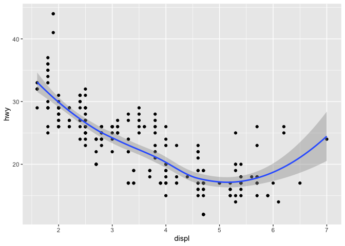

``` r
  ggsave("example.jpg")
```

    Saving 7 x 5 in image
    `geom_smooth()` using method = 'loess' and formula = 'y ~ x'

------------------------------------------------------------------------

# Take aways

You can use this starter code template to make thousands of graphs with
**ggplot2**.

``` r
ggplot(data = <DATA>) +
  <GEOM_FUNCTION>(mapping = aes(<MAPPINGS>))
```
